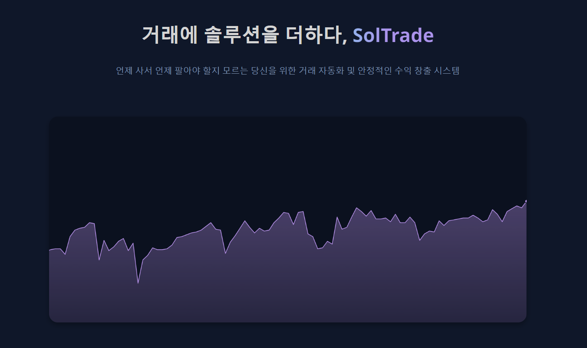

# SolTrade : 마켓 메이킹을 활용한 초과 수익 찾기

> 2023학년도 2학기 경희대학교 데이터분석캡스톤디자인 프로젝트 입니다.

## 🚀 프로젝트 소개 및 배경

계량적인 투자를 뜻하는 퀀트 투자와 수익률을 설명하는 요인은 팩터라는 개념이 발전하면서 순수한 초과 수익을 뜻하는 알파를 찾기가 어려워졌다. 이에 주가 자체가 어떠한 원리로 생성되는지를 규명하는 시장 미시구조를 활용하여 새로운 방법으로 초과 수익을 찾는다.

본 프로젝트에서는 바이낸스의 비트코인 선물 틱 데이터를 활용하여, 시장 미시구조 이론을 활용한 대표적인 분야인 마켓 메이킹을 통해 초과 수익을 찾는 자동 트레이딩 시스템, SolTrade를 개발하였다.

 

## 📌 프로젝트 구성

### 💰 거래 플랫폼 및 종목

해외 코인 거래소 Binance를 이용해서 BTCUSDT 선물 거래를 진행했습니다.

### 📈 최적 매수/매도 호가 산출 알고리즘

Binance에서 제공하는 API를 활용하여 실시간 틱데이터를 받아옵니다.
이 데이터를 마켓 메이킹 모델에 적용해 최적의 매수/매도 호가를 산출하고 해당 가격을 기반으로 주문을 넣는 구조입니다.

자세한 내용은 아래 README를 참고해주시기 바랍니다.

- [마켓 메이킹 모델: tradingbot](https://github.com/tuchongkim/visualize-binance/tree/main/tradingbot)

### 🖥️ 실시간 주문 내역 및 포지션 확인

flask, html, css, javascript를 기반으로 실시간 주문 내역을 확인할 수 있는 웹페이지를 만들었습니다.

자세한 내용은 아래 README를 참고해주시기 바랍니다.

- [웹페이지: SolTrade](https://github.com/tuchongkim/visualize-binance/tree/main/web)

 

## References

- [sample-trading-bot](https://github.com/nkaz001/sample-trading-bot) by [nkaz001]
- [hftbacktest](https://github.com/nkaz001/hftbacktest) by [nkaz001]
- 「Dealing with the Inventory Risk. A solution to the market making problem」 Olivier Guéant, Charles-Albert Lehalle, Joaquin Fernandez Tapia (2012)

 

## 팀 소개

#### 경희대학교 소프트웨어융합학과 19학번 김두종

#### 경희대학교 소프트웨어융합학과 19학번 허준수
